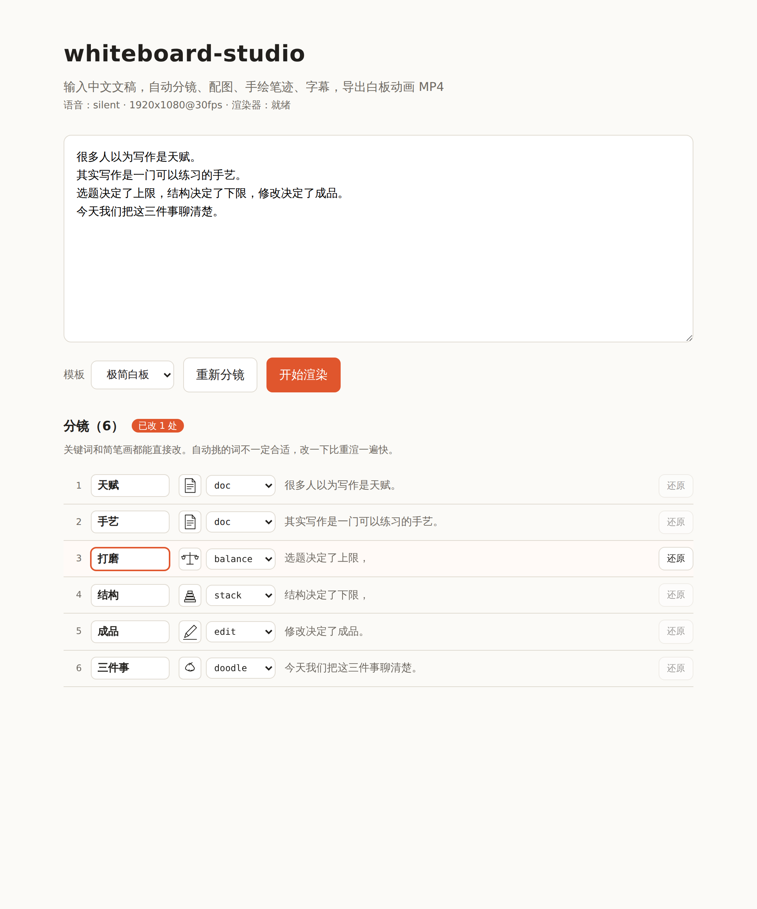

# whiteboard-studio

输入一段中文文稿，自动完成**分镜 → 关键词 → 简笔画 → 配音 → 手绘笔迹动画 → 字幕 → MP4**。

```
文稿  ──▶  分镜切分  ──▶  关键词 + 简笔画  ──▶  笔迹
                              │                 │
                              ▼                 ▼
                          语音合成  ────▶  时间轴装配  ──▶  Remotion 渲染  ──▶  MP4
```

---

## 装完就能出片，不联网、不要 key

流水线上有三个位置可以接外部服务，**默认值全都是本地实现**：

| 位置 | 默认 | 做什么 | 需要联网 |
| --- | --- | --- | --- |
| 分镜标注 | `local` | 自实现的中文分词 + 词性打分挑关键词，触发词匹配选简笔画 | 否 |
| 配图 | `builtin` | 32 个内置简笔画 + 关键词哈希涂鸦兜底 | 否 |
| 语音 | `silent` | 按字数估算每镜时长（4.5 字/秒），不生成音频 | 否 |

这不是「阉割版」——本地标注器带一份 6.4 万条的中文词典，简笔画覆盖口播稿里
常见的抽象概念。四镜文稿的标注耗时是 **0 秒**，接大模型的版本是 48 秒。

关掉外部服务时，代码路径完全不经过它们；相关配置项不填也不会有任何影响。

想接外部服务见下文 [可选：接入外部服务](#可选接入外部服务)——先说结论：
**标注器值得开，AI 生图不建议默认开。**

---

## 快速开始

需要 Node.js ≥ 22.13 和 Python ≥ 3.11。

```bash
# 1. 渲染层
cd renderer && npm install && cd ..

# 2. 后端
cd backend && pip install -e ".[dev]"
uvicorn app.main:app --port 8000 --reload

# 3. 前端（另开一个终端）
cd web && npm install && npm run dev
```

打开 <http://localhost:5173>，粘贴文稿，点「开始渲染」。**到这一步就能出片了**，
不需要配任何东西。

一段 17 秒的成片在单核容器里大约 90 秒渲完；渲染是 CPU 密集型，核多会快很多。

### 无头环境 / CI

容器里通常没有 GPU，也不该让 Remotion 每次去下 Chromium：

```bash
export WBS_BROWSER_EXECUTABLE=/path/to/chrome   # 复用已有的 Chromium/headless shell
export WBS_RENDER_CONCURRENCY=1                 # 内存紧张时设为 1
```

渲染器已经在 `remotion.config.ts` 里指定了 `swangle` 软件渲染管线，无 GPU 也不会黑屏。

---

## 分镜是可编辑的

自动挑的关键词不会每次都合适——**这是启发式和大模型共同的问题，不是换个更强的
模型就能解决的**。与其反复调参数，不如直接改：预览之后，每一镜的**关键词**和
**简笔画**都能在界面上改，改完再渲染。



改过的行会标出来，「还原」按钮退回自动结果。改了文稿之后分镜下标可能错位，
界面会挡住渲染并提示重新分镜（后端也会用 `script_digest` 二次校验，返回 409）。

实践下来，这一层比任何自动化都可靠——挑错了改一个词、换一张图，五秒钟的事。

## 只想看分镜，不想等渲染

改文稿的时候没必要每次都渲一遍：

```bash
curl -s -X POST localhost:8000/api/preview \
  -H 'Content-Type: application/json' \
  -d '{"text":"人工智能正在改变软件开发的方式。"}'
```

```json
{"scenes": [{"index": 0, "text": "人工智能正在改变软件开发的方式。",
             "keyword": "人工智能", "concept": "code",
             "auto_keyword": "人工智能", "auto_concept": "code"}],
 "script_digest": "bce7db1b8d2a28d3"}
```

`auto_*` 是自动结果，`keyword` / `concept` 是应用修正之后的值——两者分开存
才能显示「已改过」并支持还原。渲染时把修正原样发回：

```bash
curl -s -X POST localhost:8000/api/jobs -H 'Content-Type: application/json' -d '{
  "text": "...", "script_digest": "bce7db1b8d2a28d3",
  "overrides": [{"index": 0, "keyword": "大模型", "concept": "gear"}]
}'
```

前端的「预览分镜」按钮就是它，秒回。

---

## HTTP 接口

| 方法 | 路径 | 说明 |
| --- | --- | --- |
| `GET` | `/api/health` | 服务状态、标注器/配图器/TTS 配置、渲染器是否就绪 |
| `GET` | `/api/concepts` | 可选的简笔画概念，带笔迹供前端画缩略图 |
| `POST` | `/api/preview` | 只做分镜和关键词，不渲染；返回 `script_digest` |
| `POST` | `/api/jobs` | 创建渲染任务，可带逐镜修正，立即返回任务 ID |
| `GET` | `/api/jobs` | 任务列表 |
| `GET` | `/api/jobs/{id}` | 任务状态与进度 |
| `GET` | `/api/jobs/{id}/plan` | 完整渲染计划（调试用） |
| `GET` | `/api/jobs/{id}/log` | 渲染日志与降级原因 |
| `GET` | `/api/jobs/{id}/video` | 下载成片 |

任务产物都在 `.workspace/jobs/<id>/` 下（`plan.json`、`audio/`、`output.mp4`），
服务重启后历史任务和已渲好的成片仍然读得到。

---

## 目录结构

```
backend/
  app/
    main.py              FastAPI 路由
    jobs.py              任务队列、进度、断点落盘
    render.py            调用 Remotion 的唯一入口
    pipeline/
      script.py          文稿 → 分镜
      segment.py         中文分词（最大概率分词 + 内置词典）
      keywords.py        分词结果 → 关键词
      sketch.py          内置简笔画（32 个概念 + 兜底涂鸦）与笔迹时间片分配
      vectorize.py       线稿位图 → SVG 中心线笔迹（细化 + RDP + 贝塞尔平滑）
      annotate/          分镜标注器：local（默认）/ glm
      illustrate/        配图器：builtin（默认）/ glm_image
      tts/               语音合成：silent（默认）/ indextts_local / indextts_http
      data/              zh_words.txt.gz：分词词典
      timeline.py        装配成 RenderPlan
renderer/                Remotion 项目，消费 RenderPlan
web/                     React 前端
```

---

## 可选：接入外部服务

三个位置都能换成外部服务。**都是 opt-in**，不配就是本地实现。

### 值得开：分镜标注 `glm`

```bash
export WBS_ANNOTATOR=glm
export WBS_GLM_API_KEY=...      # 详见 docs/annotate.md
```

一次请求标注全篇，按语义选简笔画而不是靠触发词命中。实测同一段文稿：
兜底涂鸦从 1 镜降到 0，相邻重复的图消失。

**一个任务只调一次**，成本可以忽略，失败自动退回 `local`。见
**[docs/annotate.md](./docs/annotate.md)**。

### 按需开：语音 `indextts_*`

默认的 `silent` 不生成音频，只按字数估时长——成片是**没有声音的**。

接 IndexTTS 有两条路：`indextts_local`（进程内调用上游 Python API）和
`indextts_http`（OpenAI 兼容的 `/v1/audio/speech`，模型跑在别的机器上）。
参考音频始终留在跑模型的那台机器上。见 **[docs/tts.md](./docs/tts.md)**。

### 不建议默认开：AI 生图 `glm_image`

调生图模型画配图，再取中心线骨架转成可绘制的笔迹（位图没法做「一笔一笔画出来」
的动画，这一步是必需的）。

**实测可用率约一半。** 同一段文稿的四镜：

| 视觉隐喻 | 生成结果 | 结局 |
| --- | --- | --- |
| 一把锤子 | 干净线稿 | ✅ 可用 |
| 一支铅笔 | 干净线稿 | ✅ 可用 |
| 一颗星星 | 实心黑星 | ❌ 质量闸门拒绝，退回内置 |
| 一座积木塔 | 带砖块纹理 | ⚠️ 笔迹很碎 |

代价是每镜一张图、按张收费、每镜十几秒，而且结果不可复现。质量闸门保证了
不会输出一团乱线，但也意味着有一部分镜头拿不到 AI 配图。

**内置简笔画在稳定性上仍然更强**，这条路适合「愿意多花钱换点变化」的场景。
见 **[docs/illustrate.md](./docs/illustrate.md)**。

### 换掉渲染层

`render.py` 是唯一和 Remotion 耦合的文件。换 FFmpeg/Canvas 方案只需要另写一个
同签名的 `render_video(plan, job_dir, settings, on_log) -> Path`。

> ⚠️ **Remotion 不是标准开源协议**。个人、非营利组织和 3 人及以下的公司免费；
> 达到规模的公司商用需要购买 Company License，详见 <https://remotion.dev/license>。

### 降级都会留痕

外部服务失败时的策略是分别定的，判据是**兜底之后交付的东西是否还完整**：

| 位置 | 失败时 | 为什么 |
| --- | --- | --- |
| 语音合成 | **默认报错** | 退回静音交付的是一条没声音的片子，残缺的成品 |
| 分镜标注 | 退回 `local` | 只是词挑得没那么好，片子完整 |
| 配图 | 退回 `builtin` | 只是图没那么贴切，片子完整 |

三种情况都不会悄悄发生：降级原因一律写进 `GET /api/jobs/{id}/log`。

---

## 和 cs-board 的关系

产品形态参考了 [cs-board](https://github.com/ChenShuo2004/cs-board)（MIT）。
**代码是独立实现**，不是它的 fork 或副本。cs-board 的版权与许可证声明保留在
[NOTICE](./NOTICE) 中。

---

## 已知限制

- 中文关键词是**擦除动画**，不是真笔顺书写——真笔顺需要汉字笔画数据集。
- 内置简笔画只有 32 个概念，命不中就画兜底涂鸦。
- 相邻镜头会尽量避免画同一张图，但当次优候选明显更差时会保留重复——
  画对但重复，好过画错。整段都在讲同一件事时，连着几镜同一张图是正常的。
- **默认出的片子没有声音**：`silent` 只估节奏。接 IndexTTS 见 [docs/tts.md](./docs/tts.md)。
- 关键词提取会挑到不理想的词。`local` 是启发式的（词性来自词典、没做上下文
  消歧）；`glm` 更准但不是每次都赢（实测 local 的「三件事」就比 glm 的
  「聊清楚」好）。**这也是分镜可编辑的原因。**
- AI 生图对**实心色块和纹理**无能为力——中心线法只会把实心块削成一条脊线。
- 没有做 Gradio provider——Gradio 的 HTTP 接口在大版本间变过，版本耦合太重。

## 设计说明

几个「为什么这么做」的决定记录在 [docs/architecture.md](./docs/architecture.md)：
中心线矢量化、八连通阶梯伪影、分词取舍、三层降级策略等。

## 开发

```bash
cd backend  && pytest              # 135 个用例
cd renderer && npm run typecheck
cd web      && npm run build
```

外部服务相关的用例全部对着实现同一契约的 mock 服务跑，不打真实接口、不花钱。

## 许可证

MIT，见 [LICENSE](./LICENSE)。第三方依赖与随仓库分发的数据见 [NOTICE](./NOTICE)。
